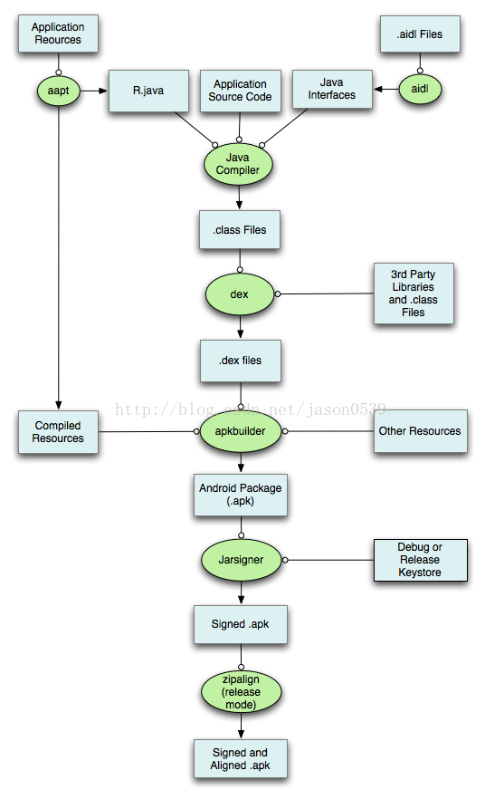

### 提高App安全性的方法

##### 1. Apk打包过程

https://blog.csdn.net/brycegao321/article/details/79127159

1. aapt: 使用aapt/aapt2打包res目录资源文件,生成R.java、resource.arsc和res目录
2. Aidl:检索工程中所有的aidl文件,并转换为对应的Java文件
3. Java:调用javac编译工具将.java文件生成.class文件
4. 生成dex文件,通过dx工具将.class文件生成为class.dex,还可以通过将multi-dex编译为calss2.dex,classesN.dex
5. 生成APK文件:使用APkbulder将resource.arsc,res目录、Androidmanifest.xml,assets目录、dex文件打包成apk
6. 签名apk文件:使用apksigner为安装包添加签名信息
7. zipalign优化签名包

| aapt(Android Asset Package Tool)             | Android资源打包工具                      | ${ANDROID_SDK_HOME} /build-tools/ANDROID_VERSION/aapt     |
| -------------------------------------------- | ---------------------------------------- | --------------------------------------------------------- |
| aidl(android interface definition language ) | Android接口描述语言                      | ${ANDROID_SDK_HOME}/build-tools/ANDROID_VERSION/aidl      |
| Java compile                                 | javac(Java的编译器)                      | ${JDK_HOME}/javac或/usr/bin/javac                         |
| dex                                          | 转化.class文件为Davik VM能识别的.dex文件 | ${ANDROID_SDK_HOME}/build-tools/ANDROID_VERSION/dx        |
| apkbuilder                                   | 生成apk包                                |                                                           |
| Apksigner                                    | 签名apk                                  | ${ANDROID_SDK_HOME}/build-tools/ANDROID_VERSION/apksigner |
| zipalign                                     | 字节码对齐工具优化apk                    | ${ANDROID_SDK_HOME}/build-tools/ANDROID_VERSION/zip       |

##### 2. 使用proguard

- 压缩 : 通过分析字节码,移除没有使用到的方法、类、属性
- 优化 : 优化Java字节码,移除字节码中没有使用到的指令
- 混淆 : 使用无意义的字母来代替类名、方法名、字段名
  - 四大组件不能混淆
  - 自定义View不能混淆
  - bean类不能混淆
  - 接口 注解不能混淆
- 预校验 : 对上述处理后的代码进行预处理

##### 3. 加固

##### 4. https+ssl pining

