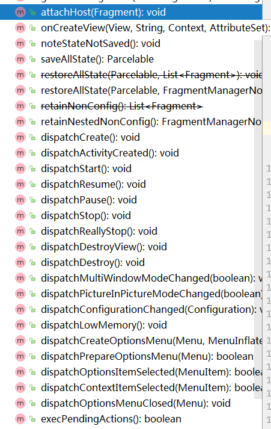

## Fragment的生命周期

我们知道Fragment的生命周期，受两方面的影响

- 所依附的宿主Activity的生命周期
- 在Activity中Fragment切换显示

那么接下来我们由这两方面来阐述Fragment的生命周期

> 跟随宿主Activity的生命周期

```java
/**
 * Provides integration points with a {@link FragmentManager} for a fragment host.
 * <p>
 * It is the responsibility of the host to take care of the Fragment's lifecycle.
 * The methods provided by {@link FragmentController} are for that purpose.
 */
public class FragmentController {
    private final FragmentHostCallback<?> mHost;
    public static FragmentController createController(FragmentHostCallback<?> callbacks) {
        return new FragmentController(callbacks);
    }
    private FragmentController(FragmentHostCallback<?> callbacks) {
        mHost = callbacks;
    }
    /**
     * Returns a {@link FragmentManager} for this controller.
     */
    public FragmentManager getSupportFragmentManager() {
        return mHost.getFragmentManagerImpl();
    }
    ...
}
```

通过`FragmentController`的类声明文件**It is the responsibility of the host to take care of the Fragment's lifecycle.**，我们可以很清楚的了解到，Fragment的生命周期是通过FragmentController来控制的。



那么看到这里我们就猜想，**一定是Activity持有FragmentController的引用，当Activity的生命周期发生变化调用FragmentController对应的disptchXXX()来执行生命周期。**

在`FragmentActivity`中通过

```java
final FragmentController mFragments = FragmentController.createController(new HostCallbacks());
```

获取了`FragmentController`的实例，正如我们上述分析的那样

```	java
 ...
 @Override
    final View dispatchFragmentsOnCreateView(View parent, String name, Context context,
            AttributeSet attrs) {
        return mFragments.onCreateView(parent, name, context, attrs);
    }

    /**
     * Destroy all fragments.
     */
    @Override
    protected void onDestroy() {
        super.onDestroy();

        doReallyStop(false);

        if (mViewModelStore != null && !mRetaining) {
            mViewModelStore.clear();
        }

        mFragments.dispatchDestroy();
    }
    ...
```

这里我只粘贴了部分代码，其他生命周期的调用方式也大同小异。

> 在Activity中切换Fragment引起的生命周期

建议在看这里的同学，先看我的另一篇文章