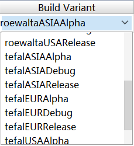

### 第四章：创建构建Variant

> **构建类型**

- 创建构建类型

  AndroidStudio默认会给我们生成一个构建类型`Release`除外他还会有一个默认的构建类型`Debug`；

  在构建类型的使用过程中，其实我们不得不说一个重要角色`buildConfigField`，Gradle为我们提供了，通过这个角色我们可以生成动态的常量（根据不同的构建类型）；

  例如：我们想在alpha版本中保留Log，我们在保证其他配置与release版本相同，只是将日志功能打开；

  ```groovy
  release {
       buildConfigField "Boolean", 'isOpenLog', 'false'
       minifyEnabled false
       proguardFiles getDefaultProguardFile('proguard-android.txt'), 'proguard-rules.pro'
  }
  alpha {
       buildConfigField "Boolean", 'isOpenLog', 'true'
       minifyEnabled false
       proguardFiles getDefaultProguardFile('proguard-android.txt'), 'proguard-rules.pro'
  }
  ```

  除此之外可以设置

- 源集

  **没看懂**

- 依赖

  可以针对创建的构建类型进行选择依赖，测试环境，整个环境

  ```groovy
  implementation fileTree(dir: 'libs', include: ['*.jar'])
  implementation 'com.android.support:appcompat-v7:27.1.1'
  implementation 'com.android.support.constraint:constraint-layout:1.1.0'
  testImplementation 'junit:junit:4.12'
  androidTestImplementation 'com.android.support.test:runner:1.0.2'
  androidTestImplementation 'com.android.support.test.espresso:espresso-core:3.0.2'
  ```

> **product flavor**

在开发`SEB`项目中，客户希望可以针对欧洲版本的代码，再出一个亚洲（Asia）版本的，因为了解到需求，这两个版本最后是要同时上线的，那么就必须保证{applicationId}每个版本是不一致的，除此之外启动页的图片，版本号会有差异，那么这个需求就是productFlavor的典型的应用场景；

- 创建product flavor

  ```groovy
  productFlavors {
          Asia {
              buildConfigField("Boolean","isAsiaBranch",'true')
              applicationId "com.groupeseb.airpurifier.asia"
              versionCode 1
              versionName "1.0.0"
              resValue "string", "app_name", "Pure Air"
              setProperty("archivesBaseName", "SEB-${versionName}-${releaseTime()}")
          }
          Eur_America {
              buildConfigField("Boolean","isAsiaBranch",'false')
              applicationId "com.groupeseb.airpurifier"
              versionCode 1
              versionName "1.0.0"
              resValue "string", "app_name", "Pure Air"
              setProperty("archivesBaseName", "SEB-${versionName}-${releaseTime()}")
          }
      }
  ```

  那么上述代码，根据不同的地区设置了不同的applicationId，及版本相关的信息；

- 源集

  **没看懂**

- 多种定制的版本

  比如现在还是SEB项目，客户有两种品牌tefal、toewalta，要分别上线美洲，亚洲，欧洲，这样我们最后要打2*3个包，那分别配置ProductFlavor那有点累，这个时候我们可以通过flavorDimensions的方式,

  ```groovy
  flavorDimensions "version", "ervirment"
      productFlavors {
          tefal {
              dimension "version"
              applicationId "Foking"
          }
          roewalta {
              dimension "version"
              applicationId "Foking.com"
          }
          USA {
              dimension "ervirment"
          }
          ASIA {
              dimension "ervirment"
          }
          EUR {
              dimension "ervirment"
          }
  
      }
  ```

最终的结果，我们通过组合构建的方式，获取一下的Variant



