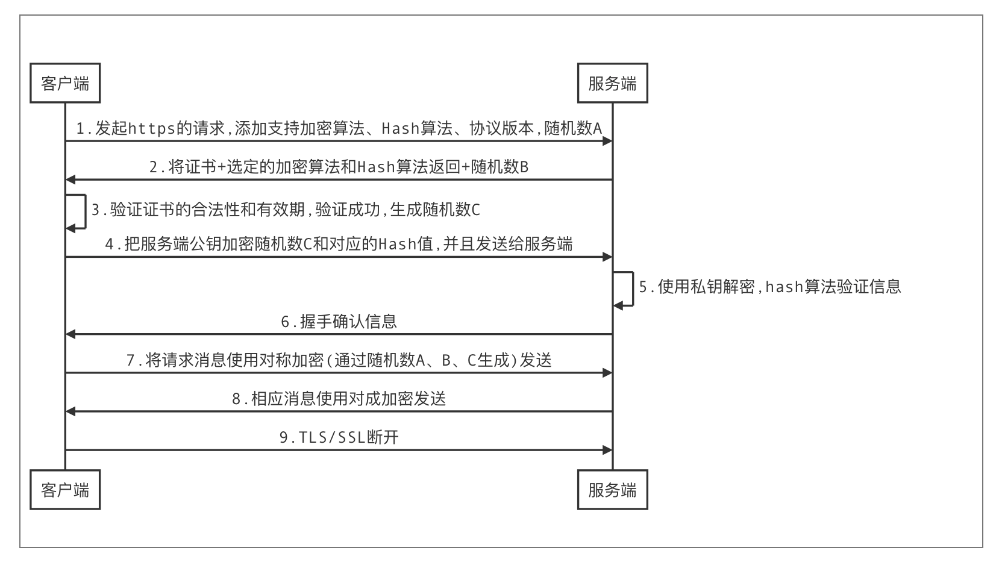
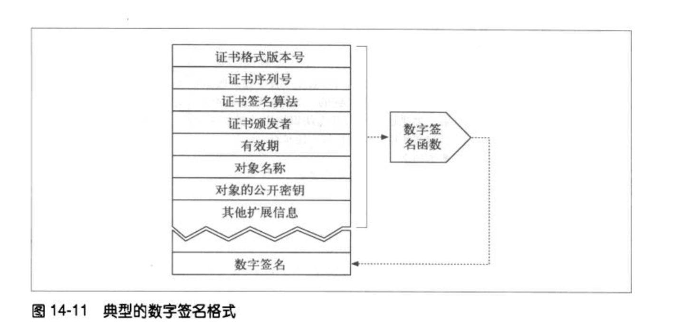
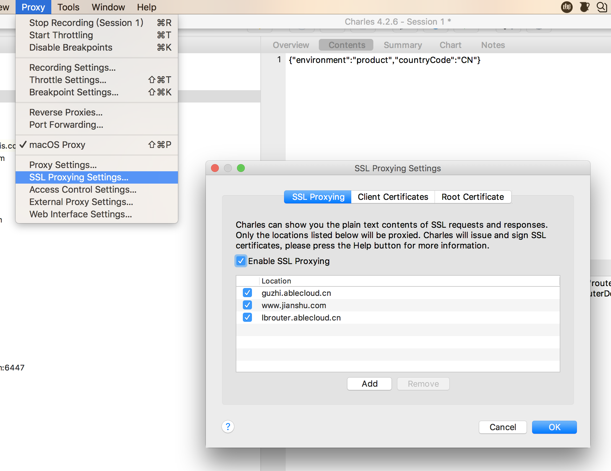
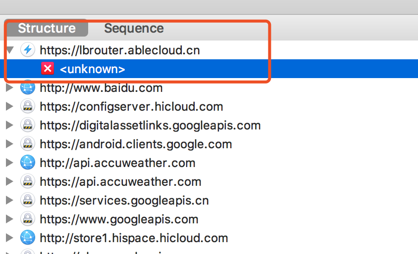
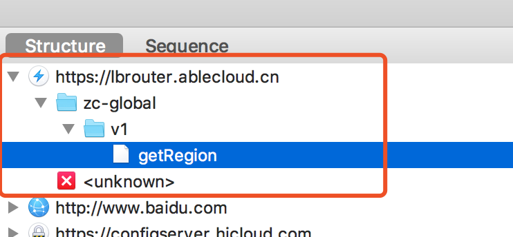

# HTTPS+Android7.0+Charles抓包

本文主要阐述

- HTTPS原理和一次SSL/TLS建立的过程
- Android7.0转HTTPS包问题
- Charles抓包原理

如果有同学没看懂,欢迎吐槽,我再修正!

## HTTPS协议: Http over SSL/TLS

https相比http,是在应用层和传输层之间添加了一个安全层,或者叫SSL/TLS层.

SSL/TLS存在的目的就是协商出一个不可能被第三方窃取的对称加密算法

SSL/TLS层中使用到了对称加密、非对称加密、Hash算法

```
非对称加密算法：RSA，DSA/DSS 
对称加密算法：AES，RC4，3DES 
HASH算法：MD5，SHA1，SHA256
```

**下面的这个图简直不能在形象、具体、生动,来描述SSL握手的过程**


#### HTTPS请求的过程:



证书包含的内容:

- 对象(服务器地址、服务器公钥)
- 数字签名算法
- 证书过期时间
- 证书发布者
- 证书的数字签名

**附加:**

1. 如何验证证书的合法 : 系统会预装所有受信任证书机构的根证书,如果该证书的发证方不在系统预装的收信任证书中,那么会认为该证书不合法,会弹出警告⚠️

2. 如何验证就是我们想要连接的服务器的信任证书 : 我们知道,信任证书不会只颁发给同一个人/机构,有可能会出现其他持有受信任证书的机构来劫持我们的请求,为了避免这种情况出现,就在数字证书中添加了一个数字签名,当客户端拿到证书之后,首先会校验证书中的域名是不是我们请求的域名,之后会根据证书中的内容和证书签名算法,将签名计算出,并将计算出的数字签名和当前证书中的签名比较,如果一致验证成功,反之则失败,这样就避免了一种情况出现:

   - 证书中的域名是我们请求的域名,而签名不一致的问题

   

[https原理通俗了解](https://www.cnblogs.com/zhangshitong/p/6478721.html)

[HTTPS工作原理和TCP握手机制](https://www.cnblogs.com/ttltry-air/archive/2012/08/20/2647898.html)

[图解SSL/TLS协议](http://www.ruanyifeng.com/blog/2014/09/illustration-ssl.html)

## Android7.0以上使用Charles抓Https包及其原理

不知道有没有同学在Android7.0上抓取过https的数据?

笔者比较喜欢在开发中使用抓包工具,如果一旦出现问题,能更准确的定位,可是在Android7.0以上抓取https,出现了问题

> 先大概说下我之前抓包并且遇到问题的现场,**charles是默认不抓包https的请求,如果要抓包https,则需要以下设置:**

)

**使用Android7.0手机发现抓取到结果变成..**



这我就不开心了...


然后经过研究发现(经历过换手机测试,换系统版本测试),原来在Andorid7.0上 Google,针对网络有了调整:

```
默认情况下，来自所有应用的安全连接（使用 TLS 和 HTTPS 之类的协议）均信任预装的系统 CA，而面向 Android 6.0（API 级别 23）及更低版本的应用默认情况下还会信任用户添加的 CA 存储。应用可以使用 base-config（应用范围的自定义）或 domain-config（按域自定义）自定义自己的连接。
```

这才恍然大悟,之前看7.0特性,没有关注到这一点

然后就根据[官网的文档](https://developer.android.google.cn/training/articles/security-config)进行了配置,最后如愿以偿.



熟悉的画面又出来了.

**当时在根据文档配置的过程中也有一点思考,就是,既然配置的根证书是charles的,那是不是域名也得配成电脑的IP,现在想想这个问题真的是...,也是当初不懂HTTPS原理**

> 因为今天看HTTPS原理,思考了下,那charles抓取https的过程是怎么样的呢?

看懂下幅图的前提是,先明白HTTPS原理,见上述:


1. 先安装Charles的根证书,并且信任,Android6.0及以下版本默认信任,Android7.0必须添加配置,见官网
2. 发起请求,这部分没有变化,见上述https请求过程
3. 服务端客户端发证书,也没有变化
4. 这个阶段就是比较关键了**charles判断是目标域名,charles自己根据目标域名、目标服务器的公钥在生成一份证书,并且签名,这个时候,这份证书的发布方就从一个受信任的CA机构变成Charles了**
5. 客户端拿到这个证书,通过之前安装的Charles的根证书来验证这个"真证书",发现没问题,就进行了正常的流程
6. 生成随机数,发送,客户端以为自己真正的发给了目标服务器,其实不然
7. **Charles用自己的私钥将信息解密,在用目标服务器的公钥加密,发送给目标服务器**
8. Charles发给目标服务器
9. 目标服务器解密、验证成功
10. SSL/TLS握手成功,客户端、Charles、真实服务器均有了这个加密传输信息的密钥.接下来传输的信息,Charles都可以通过这个密钥来解析,展示给我们查看.