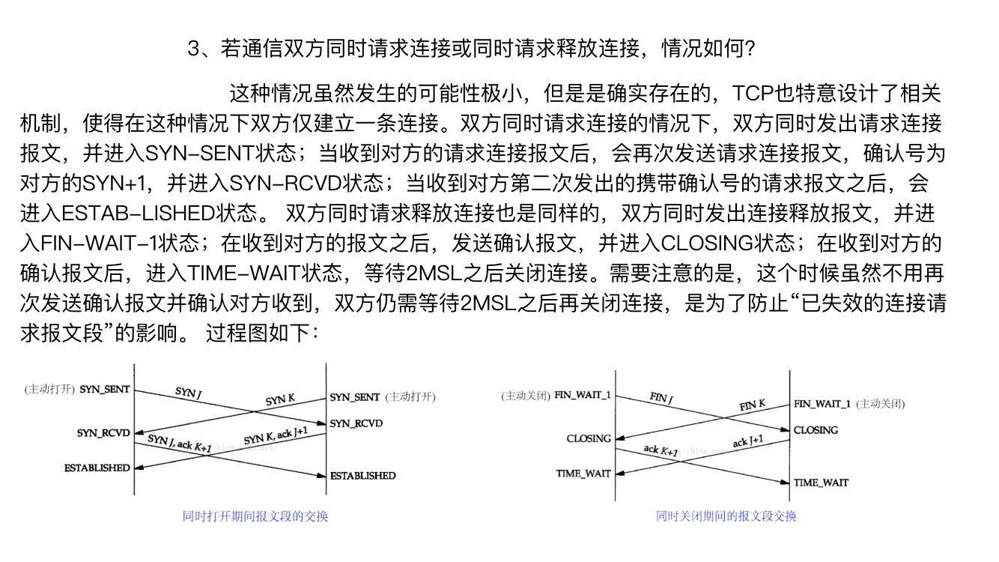

#### TCP连接

是一个面向连接的协议,建立的过程需要经过三次握手,释放的时候需要三次握手或者带有半关闭的四次握手

| 状 态       | 描 述                                                |
| ----------- | ---------------------------------------------------- |
| CLOSED      | 关闭状态，没有连接活动或正在进行                     |
| LISTEN      | 监听状态，服务器正在等待连接进入                     |
| SYN RCVD    | 收到一个连接请求，尚未确认                           |
| SYN SENT    | 已经发出连接请求，等待确认                           |
| ESTABLISHED | 连接建立，正常数据传输状态                           |
| FIN WAIT 1  | （主动关闭）已经发送关闭请求，等待确认               |
| FIN WAIT 2  | （主动关闭）收到对方关闭确认，等待对方关闭请求       |
| TIMED WAIT  | 完成双向关闭，等待所有分组死掉                       |
| CLOSING     | 双方同时尝试关闭，等待对方确认                       |
| CLOSE WAIT  | （被动关闭）收到对方关闭请求，已经确认               |
| LAST ACK    | （被动关闭）等待最后一个关闭确认，并等待所有分组死掉 |

##### 连接建立

为了不表示连接的建立需要使用两个序号

```sequence
客户端-->客户端:CLOSE
服务端-->服务端:LISTEN
客户端->服务端:1.发起一个SYN报文,SYN=1,ACK=0,添加同步序列号seq=x
客户端-->客户端:SYN_SENT
服务端->客户端:2.发起一个确认+SYN报文,SYN=1,ACK=1,添加同步序列号seq=y,确认号ack=x+1
服务端-->服务端:SYN RCVD
客户端->服务端:3.发起一个确认报文,ACK=2,添加同步序列号seq=x+1,确认号:ack=y+1
客户端-->客户端:ESTABLISHED
服务端-->服务端:ESTABLISHED
```

##### 为什么不采用二次连接

如果采用两次连接,那么会考虑到这么一种情况,如果在一次连接建立的过程中,客户端发起的请求报文,因该请求报文丢失而未收到确认,那么客户端会进行超时重传,再发送一次请求报文,那么这次的请求报文服务端收到了也建立了连接,正常传输数据,释放连接,**那假如之前第一次发起的请求报文,是因为在某一个网络节点滞留时间太长,以至于当第二个连接已将传输释放了才到达了服务器主机上,但是服务器主机收到这个请求之后,是无法断定这个请求报文是滞留的报文,还是正常报文,故而建立了连接,但是此时客户端没有建立连接的需求,所以不会搭理服务端的确认报文,但是此时服务端以为连接已经建立,所以一致在等数据发送过来,这样就白白浪费了服务器的资源.**

##### 连接释放

链接的释放有两种:三次挥手和带有半关闭选项的四次挥手

为什么关闭链接需要等待2MSL,最大报文段生存时间?

因为担心最后一个确认关闭没有发送到服务端,所以需要等待两个MSL,如果服务端没有收到客户端的确认信号是会超时重传的,为了防止服务端给客户端的超市重传也断了,所以需要等待两个MSL

###### 三次挥手

```sequence
客户端->服务端:1. 发起关闭请求,FIN=1,序列号seq=x
服务端->客户端:2. 确认关闭+请求,FIN=1,ACK=1,序列号seq=y,确认号ack=x+1
客户端->服务端:3. 确认关闭,ACK=1,序列号seq=x+1,确认号ack=y+1
客户端-->客户端:等待2MSL,关闭链接
```

###### 四次挥手

```sequence
客户端->服务端:1. 发起关闭请求,FIN=1,序列号seq=x
服务端->客户端:2. 确认关闭,ACK=1,序列号seq=y,确认号ack=x+1
服务端-->客户端: 服务端还可以给客户端发送消息
服务端->客户端:3.发起关闭请求,FIN=1,序列号seq=z,确认号ack=x+1
客户端->服务端:4. 确认关闭,ACK=1,序列号seq=x+1,确认号ack=z+1
客户端-->客户端:等待2MSL,关闭链接
```

